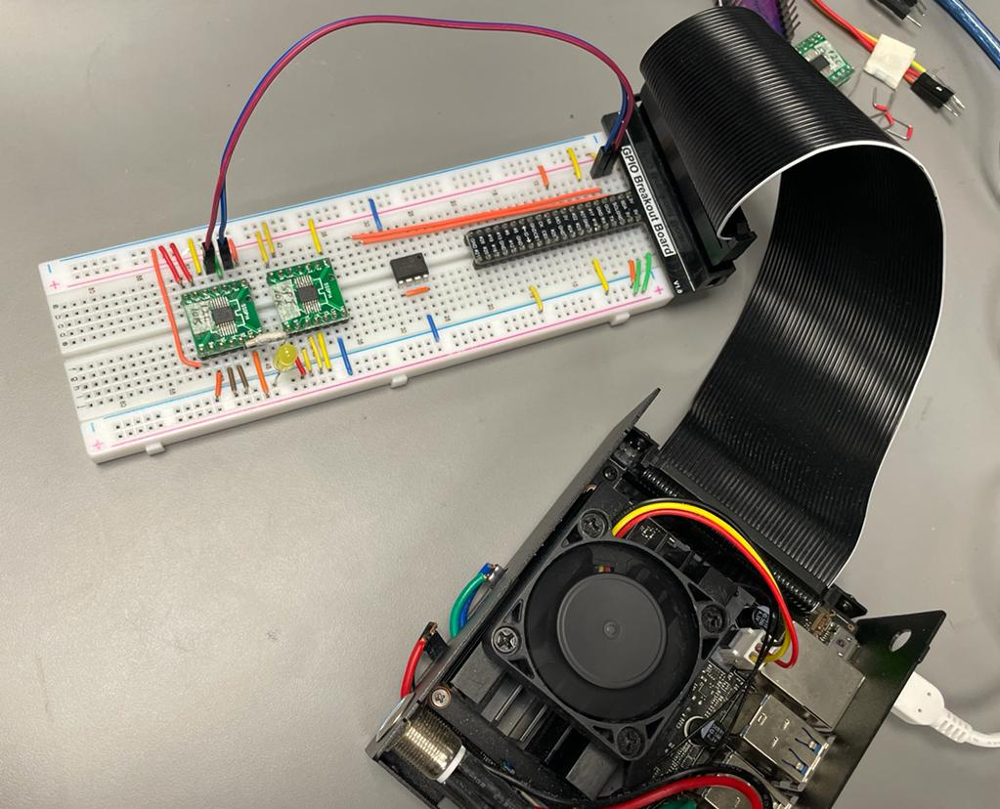

# MCP45HVX1 Digital Potentiometer Driver for Raspberry Pi / Jetson Nano
#MCP45HVX1 #Ditgital variable resistor #Potentiometer #Raspberry Pi #Jetson Nano

## Features Highlights:

- Single-Resistor Network
- Resistor Network Resolution
  - 7-bit: 127 Resistors (128 Taps >> 0 - 127) - MCP45HV31 series 
  - 8-bit: 255 Resistors (256 Taps >> 0 - 255) - MCP45HV51 series
- RAB Resistance Options:

    |RAB Value|Package Code|
    |:---:|:---:|
    |5k Ohm| -502|
    |10k Ohm|-103|
    |50k Ohm|-503|
    |100k Ohm|-104|
- High Terminal/Wiper Current (IW) Support:
  - 25 mA (for 5k Ohm)
  - 12.5 mA (for 10k Ohm)
  - 6.5 mA (for 50k Ohm and 100k Ohm)
- Resistor Network Terminal Disconnect Via:
  - Shutdown Pin (SHDN)
  - Terminal Control (TCON) Register
- Write Latch (WLAT) Pin to Control Update of Volatile Wiper Register (such as Zero Crossing)

## DEVICE SLAVE ADDRESSES
|A1|A0|I2C Address|
|:---:|:---:|:---:|
|0|0|0x3c|
|0|1|0x3d|
|1|0|0x3e|
|1|1|0x3f|

## Wiring Diagram
<table>
<thead>
  <tr>
    <th colspan="2">Raspberry Pi / Jetson Nano</th>
    <th colspan="2">MCP41HVX1</th>
  </tr>
</thead>
<tbody>
  <tr>
    <td>Pin</td>
    <td>Description</td>
    <td>Pin</td>
    <td>Description</td>
  </tr>
  <tr>
    <td>+3.3v</td>
    <td>5v is also supported</td>
    <td>1</td>
    <td>Power 1.8v to 5.5v </td>
  </tr>
  <tr>
    <td>&nbsp;&nbsp;5</td>
    <td>SCL1 (I2C Bus 1)</td>
    <td>2</td>
    <td>SCL</td>
  </tr>
  <tr>
    <td>GPIO</td>
    <td>Any GPIO Pin or GND, depends on what I2C address you want</td>
    <td>3</td>
    <td>A1</td>
  </tr>
  <tr>
    <td>&nbsp;&nbsp;3</td>
    <td>SDA1 (I2C Bus 1)</td>
    <td>4</td>
    <td>SDA</td>
  </tr>
  <tr>
    <td>GPIO</td>
    <td>Any GPIO Pin or GND, depends on what I2C address you want</td>
    <td>5</td>
    <td>A0</td>
  </tr>
  <tr>
    <td>GND</td>
    <td>(Not supported yet)</td>
    <td>6</td>
    <td>WLAT</td>
  </tr>
  <tr>
    <td>GND</td>
    <td></td>
    <td>7</td>
    <td>NC</td>
  </tr>
  <tr>
    <td>GND</td>
    <td>(Not supported yet, Can use TCON command to shutdown)</td>
    <td>8</td>
    <td>SHDN</td>
  </tr>
  <tr>
    <td>GND</td>
    <td></td>
    <td>9</td>
    <td>DGND</td>
  </tr>
  <tr>
    <td>GND</td>
    <td></td>
    <td>10</td>
    <td>V-    (Connect to external power supply max 36 volts.  Common ground with Raspberry Pi)</td>
  </tr>
  <tr>
    <td></td>
    <td>(e.g. GND)</td>
    <td>11</td>
    <td>POB   (This is the potentiometer)</td>
  </tr>
  <tr>
    <td></td>
    <td>(e.g. 330 Ohm resistor and pin + of LED)</td>
    <td>12</td>
    <td>POW   (This is the wiper of the potentiometer)</td>
  </tr>
  <tr>
    <td></td>
    <td>(e.g. +5v)</td>
    <td>13</td>
    <td>POA   (This is the potentiometer)</td>
  </tr>
  <tr>
    <td></td>
    <td></td>
    <td>14</td>
    <td>V+    (Connect to external power supply max 36 volts)</td>
  </tr>
</tbody>
</table>

## Wiring example

## 